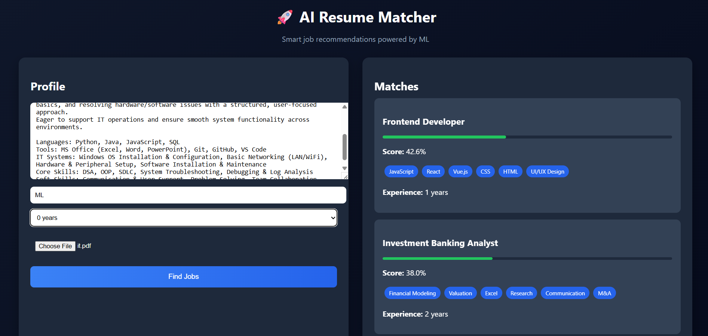

## AI Resume Job Matcher

An intelligent system that matches resumes to relevant job roles using semantic embeddings, skill extraction, and ranking logic.

## 🔥 Features

- Resume parsing (text + PDF upload)
- Skill extraction using custom skill database
- Semantic similarity using sentence-transformers
- Hybrid ranking (skills + embeddings + ML model)
- Explainable results (matched skills shown)
- Full-stack application (FastAPI + React)

---

## 📸 Demo



## Tech Stack

- Python, FastAPI
- React.js
- Sentence Transformers
- Scikit-learn
- Pandas

---

## ⚙️ How it works

1. Resume input (text or PDF)
2. Text → embeddings using transformer model
3. Skills extracted from resume
4. Compared with job dataset
5. Ranked using hybrid scoring (similarity + skills + ML)
6. Top job matches returned

---
### Backend

```bash
uvicorn app.api:app --reload

---
## Frontend
cd job-matcher-ui
npm start


Example Output
Data Analyst — Score: 0.92
Backend Developer — Score: 0.85
Machine Learning Engineer — Score: 0.81

Future Improvements
Real-time job API integration
Learning-to-rank model
Better evaluation metrics
Deployment (AWS / Vercel)
